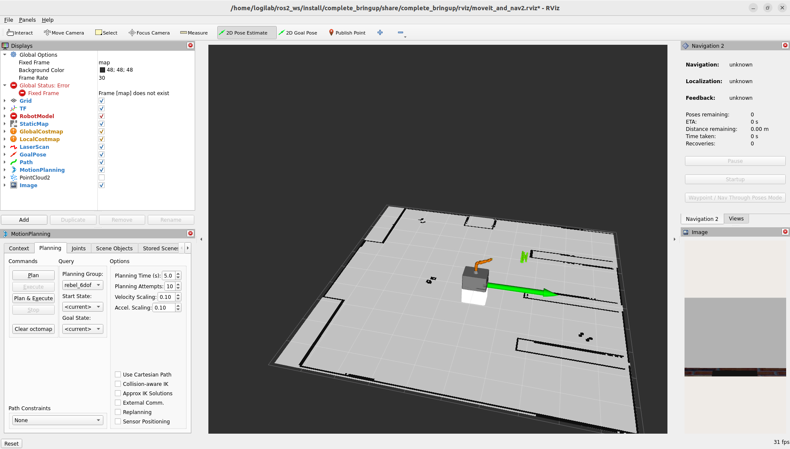

# Full Gazebo Simulation for the SEW-AGV with mounted Igus ReBel Robot Arm

## Repo Structure and ROS Packages
This is a core breakdown of the official documentation to the FE-Project of Hannes Bornamann, Mathias Fuhrer and Robin Wolf at the Hochschule Karlsruhe (SS24). This readme should guide usere to get familiar with the simulation enviroment and its capabilities. Deeper informations and background knowledge is provided in the offical documentation only.

### Usage of containerized enviroments with Docker:
The usage of Docker is a common Praxis when working with ROS2. The biggest advantage of devbeloping a ROS ecosystem inside a containerized enviroment is  that it can be used independent of the host hardware.  
Everyone who wants to use this repo has just to clone the repo from GitHub to the local disk and run the Dockerfile with executing the bash script with:  
``` 
./run_dev.sh
```
No ROS2 installation on the host machine  necessary !  
All needed ROS2-Packages are installed and set up by default when running the Dockerfile. Moreover the network setup for the ROS2 Node communication over topics with fast-RTPS defined in the dds_profile.xml is done automatically.


To use the providede Dockerfile the following prequisities are required on your host machine:
- Ubuntu 22.04 (NOT in a Virtual Machine !) https://ubuntu.com/tutorials/install-ubuntu-desktop#1-overview
- Working installation of Docker Engine https://docs.docker.com/engine/install/ubuntu/


## Provided ROS-Packages

#### Description Packages
The description packages provide the full kinematic definition and CAD data of our robot system. In ROS2 the kinematics of the robot is defined in a URDF model. The URDF model can be structred by using the xacro package and define sub-macros which are all put together in the main URDF.  
Moreover some tags regarding the hardware-communication with ROS2-Control and some tags regarding the Gazebo simulation to simulate sensors like lidar and depth camera are specified in these packages too.
- irc_ros_description: kinematic description of the Igus ReBel Arm (cloned from https://github.com/CommonplaceRobotics/iRC_ROS/tree/humble/irc_ros_description) 
- sew_agv_description: kinematic description of the sew-maxo-mts AGV at Hochschule Karlsruhe
- sew_and_igus_description: combine kinematic description of the arm and the AGV to one united robot with more DoF.

#### AGV related Packages
These packages provide further functionalities used only to control the sew-maxo-mts AGV.

- sew_agv_drivers: provides the controller definitions to control the hardware (motors) of the SEW AGV in simulation and reality. For real hardware a custom hardware interface which connects to the hardware via sew-link interface is implemented. (more informations in the whole doku) 
- sew_agv_navigation: handles connection to a xBox One controller which can be used to drive the AGV manually and provides all necessary nodes of the to navigate the AGV autonomously in a recorded map with the use of ROS2 Nav2 Stack. Functionalities for 2D SLAM-Mapping are included too.
- sew_agv_clients: provides a python class which wrapps the interaction with the simple commander interface of Nav2 in a even simpler approach to provide for the user.
  
#### Igus ReBel related Packages
These packages provide further dunctionalities used by the robot arm for motion planning and hardware communication.

- igus_drivers ??? ---> TODO
- sew_and_igus_moveit_config: configuration of the motion planning capabilities with MoveIt2 embedded in ROS2 and handling of the needed nodes to plan and execute trajectories. The handling of the occupancy-map collision gemetries extracted from the cmaera point-cloud is also done here.
- moveit_wrapper: provides service servers which can control the motion planning capabilities through the C++ move_group interface
- igus_moveit_clients: provides a python class handling clients which connect to the servers from the warpper package. The user can call the class methods from a supervised python file to provide a simple approach of using MoveIt motion planning capabilities.
  
#### Simulation Packages
This package handles the Gazebo physics simulation and their interface/ bridge to the related ROS2 topics. The simulation 
offers the capabilitie of using the robot system and testing the software without the need of real hardware (real hardware currently not available - 06/2024)

- gazebo_testenviroment: handles gazebo server and client node to provide the test enviroment for a warehouse task. All robots in the simulation are controlled by the same ROS2 controllers as the hardware is (exchange with the hardware should be simple due to ROS2 hardware interface abstraction)

#### User Interface Packages
Users can use the complete software architecture by these two packages. Its not necessary to understand all processes behind the provided user programming interface, but highly recommendet.

- complete_bringup: this package handles the correct bringup of all needed ROS2 nodes and has to be launched by the user to start the system (see How To)
- master:application: this package provides a simple programmable interface for the ROS2 ecosystem. The user can implement his own supervised control logic in python conde to move the robot system in simulation and real world by calling the metods provided in the clinet classes (see How To)

## Brief Introduction in the Software Architecture and Node Communication
The following graphics should provide a brief overview about the ROS2 ecosyetem inside this repo and how the described packages interact with each other.  
Note: this is an breakdown to a absolute minimum of information ecspecially to pick up readers who are not that familiar with ROS2. For experienced readers the usage of rqt-GUI and terminal commands to get deeper insights in node communication over topics and services/ actions is recommendet.

TODO Grapthcs with DrawIO

## How to use the Simulation
In this section we want to guide a new, unexperiences user to use our repo and develop own supervised control logics with python.

#### Clone the Repo and run the Docker Container

1) open a terminal go to a directory in the filesystem of your host machine (Terminator recommendet)
2) clone the repo: ```git clone https://github.com/RobinWolf/sew_maxo_mts_and_igus_rebel.git```
3) execute Dockerfile: ```./run_dev.sh```
4) build ROS2 Packages inside the container: ```colcon build```
5) source and install the built Packages: ```source install/setup.bash```

#### Launch all Nodes (Bringup)
1) launch required nodes by calling the launch file from the complete_bringup package ```ros2 launch complete_bringup simulation.launch.py``` or ```ros2 launch complete_bringup real.launch.py``` for real hardware (currently not supported 06/2024) - optional: set provided launch arguments if not to use the defaults
Hint: Gazebo may output a "not responding" error at the first launch. Thats common, please wait until gazebo is launched, kill the running terminal with ctrl+C and redo step 6. Now gazebo should load faster from cache.
2) optional: connect the xBox One controller to your host PC via USB
   
   
3) set the initial pose of he AGV in the world by clicking the "set initial pose" button in the top task-bar in RVIZ first and click to the current AGV pose (direction can be set with sliding while clicking). A green arrow should appear.  
   
4) now you shuld be able to navigate the AGV in RVIZ by publishing a new goal pose by first clicking the corresponding button in the top task bar and second the desired goal on the map.
   
5) Motion Planning with the arm sohuld be possible too. Just modify the joint states in the bottom left window and click the "plan and execute" button.


#### Run a supervised Control Script
1)  connect a new, second terminal to the running container with: ```docker exec -it sew_mobile_manipulator bash``` and source insite the new terminal (like step 5)
2)  execute your supervised control script: ```ros2 run master_application <your_control_script>```
3)  you should see the robots motion in RVIZ and your codes terminal feedback prints in the second terminal


#### Writing your own supervised Control Script
1) open the repo in VSCode or a similar programming IDE
2) navigate to: ```src/master_application/master_application```
3) add a new python file
4) add the new python file entrypoint to the setup.py file similar to the provided example
5) Write your own control script with the provided methods (shown below)

***AGV-Control:***
```python
def check_nav_goal(self, frameID, pose):
    """
    string frameID: frame where the pose is given in e.g. 'map'
    list pose [x,y,w]: position and quarternion angle (rad) of the goal

    Returns
    -------
    bool acknowledgement

    """
def move_to_nav_goal(self, frameID, pose):
    """
    string frameID: frame where the pose is given in e.g. 'map'
    list pose [x,y,w]: position and quarternion angle (rad) of the goal

    Returns
    -------
    int status (code which encodes status with navigation has terminated)

    """

def collision_checker(): --> TODO!!!
```
***Robot-Arm-Control:***
```python
def reset_planning_group(self, planning_group):
    """
    string planning_group: name of the planning group of the arm (default: igus_6dof)

    Returns
    -------
    bool success

    """
def setVelocity(self, fraction):
    """
    float: velocity caling coeffinet relative to joint speed limits (0.01 ... 0.5 recommendet)

    Returns
    -------
    bool success

    """
def home(self):
    """

    Returns
    -------
    bool success

    """
def ptp(self, pose: Affine):
    """
    cartesian goal pose: affine transformation martix format (can be converted from x,y,z, r,p,y od x,y,z and quaternion)

    Returns
    -------
    bool success

    """
def ptp_joint(self, joint_positions: List[float]):
    """
    joint space goal pose: list of goal joint states (rad)

    Returns
    -------
    bool success

    """
def lin(self, pose: Affine):
    """
    cartesian goal pose: affine transformation matrix format (can be converted from x,y,z, r,p,y od x,y,z and quaternion)

    Returns
    -------
    bool success

    """
def clear_octomap(self):
    """
    Returns
    -------
    None
    """
```


--------------------------------------------------------------------------------------------------------------------------------

## notes/ links for navigation - doku:
- localization concept graphics: http://wiki.ros.org/amcl
- nav2 code: https://github.com/ros-navigation/navigation2
- amcl configuration guide: https://docs.nav2.org/configuration/packages/configuring-amcl.html
- lifecycle managed nodes: https://design.ros2.org/articles/node_lifecycle.html

save a map: ros2 run nav2_map_server `map_saver_cli -f ~/ros2_ws/src/sew_agv_navigation/config/navigation/maps/<name>`